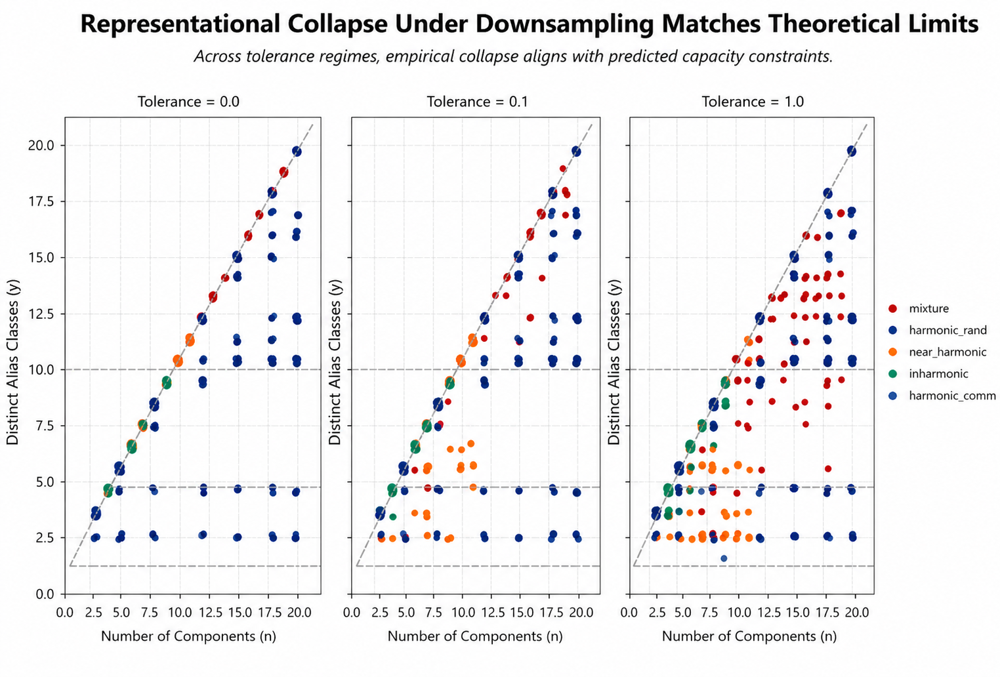
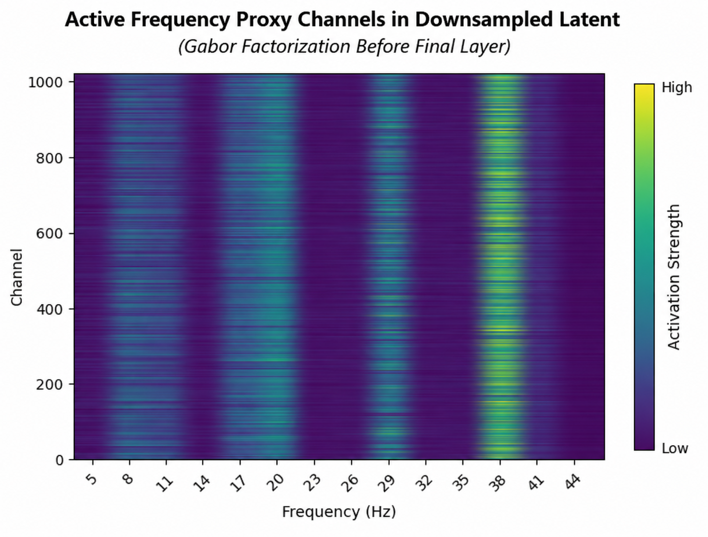
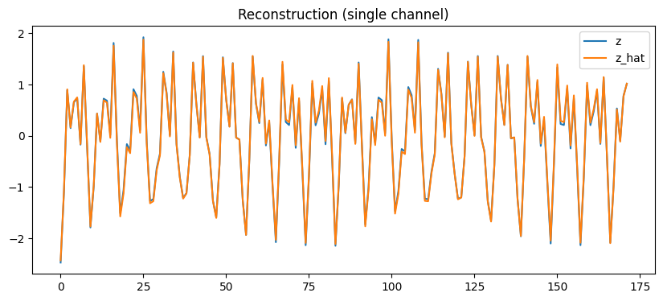

README

# Architectural Constraints on Feature Emergence in Neural Audio Models

This repository contains code and experiments for my dissertation research on why state-of-the-art neural audio models struggle to represent and control perceptually and physically meaningful features like pitch.

## Overview

Modern audio generation systems can produce convincing outputs, but they often fail to expose stable, controllable representations of basic musical features. This project investigates why. I show that interactions between model architecture and audio data geometry produce representational entanglements that make features like pitch difficult to isolate.

The core idea is that controllability is partly an architectural problem. By modifying design choices such as stride ratios, nonlinearities, and latent factorization, we can improve linear feature separability without reducing model performance. This reframes controllability as a design problem rather than a training limitation.

## Start Here

I pushed all code to simple notebooks, which live in: `notebooks/`

Each notebook contains the main experiments, visualizations, and findings from a different chapter of my dissertation (organized according to location in the encoder).

Note: The notebooks are provided for reference and readability; running them end-to-end may require additional setup (datasets, model weights, environment configuration).

## Repository Structure

- notebooks/: Main research notebooks and analyses
- figures/: Key visualizations from experiments
- requirements.txt: Approximate Python dependencies

## Status

This repository is under active development. I am currently refactoring research notebooks into cleaner scripts and documenting the core experimental pipeline.

## Example Results

